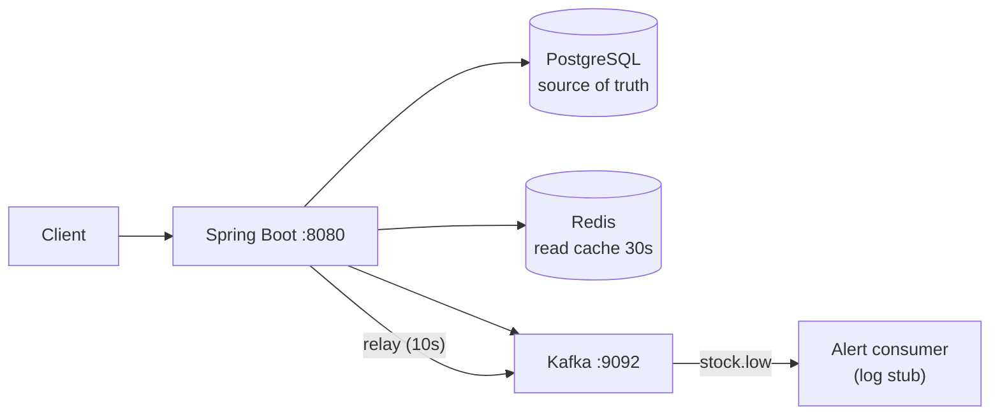
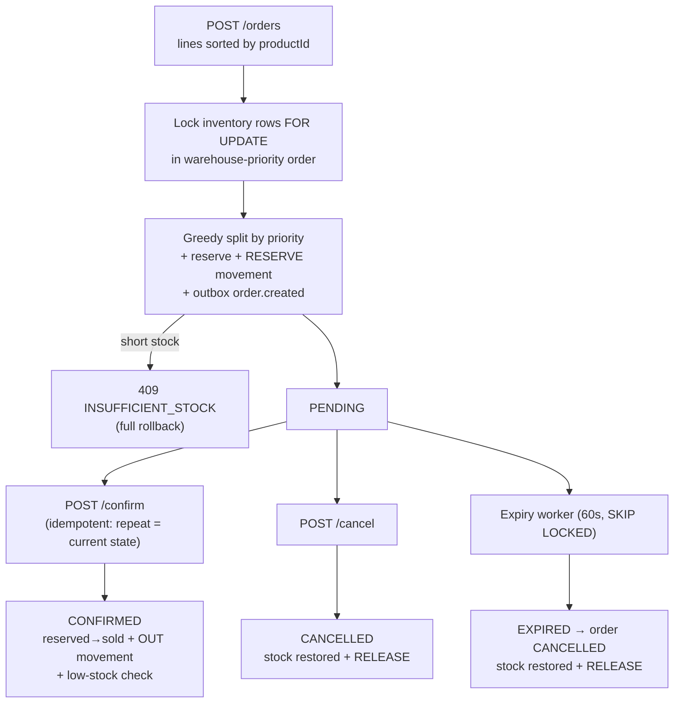
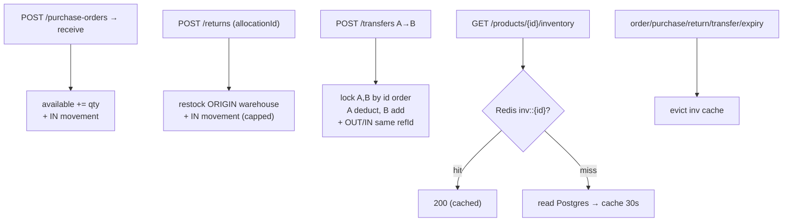

# Inventory & Order Management System

Backend portfolio (Java Developer): manage **products & inventory across multiple warehouses**,
keep stock accurate under **concurrent orders**. Built with **Java + Spring Boot + PostgreSQL + Redis + Kafka + Docker**.

> GitHub: https://github.com/dhaanisaputra/inventory-order-management-system

## Key Features (roadmap)

- [x] Product management
- [x] Multiple warehouses
- [x] Real-time inventory
- [x] Concurrency-safe ordering (transactions + locking)
- [x] Order management
- [x] Stock reservation
- [x] Returns
- [x] Purchase orders
- [x] Low-stock alerts
- [x] Inventory synchronization
- [x] Stock movement history

## You'll see in this repo

Database modeling, transactions, concurrency, pessimistic/optimistic locking,
event-driven architecture (Kafka), caching (Redis), distributed backend concepts.

## Insights (rule-based)

- [x] Demand forecasting
- [x] Smart stock replenishment
- [x] Inventory anomaly detection
- [x] Product recommendations
- [x] AI inventory assistant

## Quickstart

```bash
docker compose up -d
./mvnw spring-boot:run
```

Default: app `:8080`, Postgres `:5432` (inventory/inventory, db `inventory_db`),
Redis `:6379`, Kafka `:9092`. Health: `/actuator/health`.

## Project structure (planned)

```
src/main/java/com/sample/inventory/
  product/ warehouse/ inventory/ order/ reservation/
  purchase/ returns/ alert/ movement/ common/
```

MVP order: product + warehouse + inventory + order with reservation → movement history →
purchase/returns/alerts → Kafka + Redis → AI stubs.

## API

| Method | Path | Keterangan |
|---|---|---|
| POST | /api/v1/products | create (201), duplicate sku → 409 |
| GET | /api/v1/products?q=&page=&size=&sort= | paged, sort whitelist: sku,name,createdAt |
| GET / PATCH | /api/v1/products/{id} | detail / rename + active flag |
| POST | /api/v1/warehouses | create (201) |
| GET | /api/v1/warehouses | list polos by priority |
| GET / PATCH | /api/v1/warehouses/{id} | detail / rename + reprioritize |
| POST | /api/v1/orders (+ Idempotency-Key) | create split allocation (201), 409 if short |
| GET | /api/v1/orders?status=&from=&to= | paged, sort: createdAt |
| GET | /api/v1/orders/{id} | detail with lines + allocations |
| POST | /api/v1/orders/{id}/confirm | idempotent confirm (200) |
| POST | /api/v1/orders/{id}/cancel | cancel + restock (200) |
| GET | /api/v1/inventories?productId=&warehouseId=&lowStockOnly= | paged |
| GET | /api/v1/stock-movements?... | paged + type/date filters |
| POST | /api/v1/purchase-orders | create PO (201) |
| GET | /api/v1/purchase-orders | paged, sort: createdAt |
| POST | /api/v1/purchase-orders/{id}/receive | partial/full receive (200), over-receive → 400 |
| POST | /api/v1/returns | return to origin warehouse (201), over-return → 400 |
| GET | /api/v1/returns | paged, sort: createdAt |
| GET | /api/v1/products/{id}/inventory | per-warehouse stock, Redis cached (30s) |
| GET | /api/v1/stock-movements | (existing — now also emits Kafka events) |
| POST | /api/v1/transfers | move stock A→B (201), short source → 409 |
| GET | /api/v1/transfers | paged, sort: createdAt |
| GET | /api/v1/insights/demand?productId=&days= | moving-average forecast |
| GET | /api/v1/insights/replenishment | reorder-point suggestions |
| GET | /api/v1/insights/anomalies?days= | rule-based anomalies |
| GET | /api/v1/insights/recommendations?productId= | bought-together top 5 |
| POST | /api/v1/insights/assistant | rule-based inventory Q&A |

Events (Kafka): `inventory.order.created|confirmed|cancelled`, `inventory.stock.movement` via transactional outbox + relay (10s); `inventory.stock.low` fire-and-forget on confirm, logged by alert consumer.

Swagger UI: /swagger-ui.html — OpenAPI: /v3/api-docs

## Flows

### System overview



### Order lifecycle (single transaction per transition)



### Inbound, returns, transfers, cache


